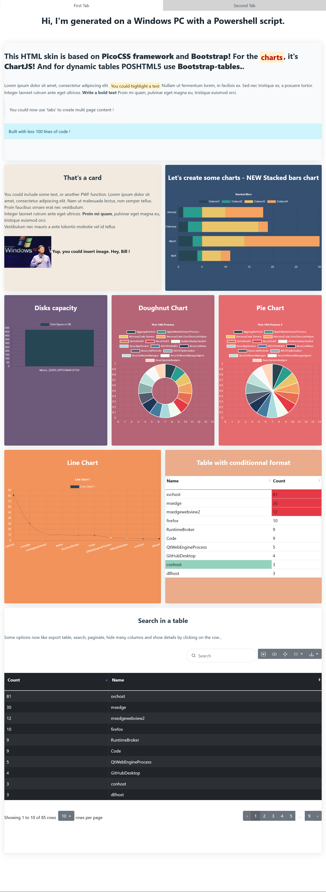

# Sample in Github Repository

## Source code
``` powershell
$TestPage = New-PWFPage -Title "MY FIRST TEST" -Content {
  New-PWFTabContainer -Tabs {
    New-PWFTab -Name "First Tab" -Content {
      New-PWFCardHeader -BackgroundColor "#fff" -Center -Content {
        New-PWFTitles -TitleText "Hi, I'm generated on a Windows PC with a Powershell script." -Size 1 -Center
      }
      New-PWFRow -Content {
        New-PWFColumn -Content {
          New-PWFCard -Content {
            New-PWFTitles -Size 2 -TitleText "This HTML skin is based on $(New-PWFTextFormat -Bold "PicoCSS framework") and $(New-PWFTextFormat -Bold "Bootstrap!") For the $(New-PWFTextFormat -ColorHexa "#BF0413" -Highlight "charts"), it's $(New-PWFTextFormat -Bold "ChartJS!") And for dynamic tables POSHTML5 use $(New-PWFTextFormat -Bold "Bootstrap-tables.")."
            New-PWFText -YourText "Lorem ipsum dolor sit amet, consectetur adipiscing elit. $(New-PWFTextFormat -Highlight -YourText "You could highlight a text") Nullam ut fermentum lorem, in facilisis ex. Sed nec tristique ex, a posuere tortor.
            Integer laoreet rutrum ante eget ultrices. $(New-PWFTextFormat -Bold "Write a bold text") Proin mi quam, pulvinar eget magna eu, tristique euismod orci."
            New-PWFBlockQuote -YourText "You could now use 'tabs' to create multi page content !"
            New-PWFAlert -YourText "Built with less 100 lines of code !" -ContextualColor info
          }
        }
      }
      New-PWFRow -Content {
        New-PWFColumn -Content {
          New-PWFCard -BackgroundColor "#F2EADF" -Content {
            New-PWFTitles -Size 3 -TitleText "That's a card" -Center
            New-PWFText -YourText "You could include some text, or another PWF function. Lorem ipsum dolor sit amet, consectetur adipiscing elit. Nam ut malesuada lectus, non semper tellus. Proin faucibus ornare erat nec vestibulum.
            Integer laoreet rutrum ante eget ultrices. $(New-PWFTextFormat -Bold "Proin mi quam"), pulvinar eget magna eu, tristique euismod orci.
            Vestibulum nec mauris a ante lobortis molestie vel id tellus"
            New-PWFImage -ImageURL "https://cdn.britannica.com/71/103171-050-BD1B685A/Bill-Gates-Microsoft-Corporation-operating-system-press-2001.jpg" -WidthInPercent 30
            New-PWFTextFormat -YourText "Yup, you could insert image. Hey, Bill !" -Bold
          }
        }
        New-PWFColumn -Content {
          New-PWFCard -BackgroundColor "#355070" -Content {
            New-PWFTitles -Size 3 -TitleText "Let's create some charts - NEW Stacked bars chart" -LightMode -Center
            New-PWFChart -Stacked -ChartTitle "Stacked Bars" -ChartType "bar" -Legends "January;February;March;April" -Horizontal -LightMode -StackedContent {
              New-PWFChartStackedDataset -Name "Dataset1" -Values "1;2;3;4"
              New-PWFChartStackedDataset -Name "Dataset2" -Values "4;3;2;1"
              New-PWFChartStackedDataset -Name "Dataset3" -Values "5;12;9;4"
              New-PWFChartStackedDataset -Name "Dataset4" -Values "8;2;16;2"
            }
          }
        }
      }
      New-PWFRow -Content {
        New-PWFColumn -Content {
          New-PWFCard -BackgroundColor "#6d597a" -Content {
            New-PWFTitles -Size 3 -TitleText "Disks capacity" -LightMode -Center
            $DisksInfos =  (Get-Disk | Select-Object FriendlyName,@{Name='Size in GB'; Expression={[math]::Round(($_.Size/1GB),2)}})
            New-PWFChart -ChartValues $DisksInfos."Size in GB" -ChartLabels $DisksInfos.FriendlyName -ChartTitle "Disk Space in GB" -ChartType bar -LightMode -DontShowTitle
          }
        }
        New-PWFColumn -Content {
          New-PWFCard -BackgroundColor "#b56576" -Content {
            New-PWFTitles -Size 3 -TitleText "Doughnut Chart" -LightMode -Center
            $Process = (Get-Process | Select-Object -first 15) | Group-Object Name | select Name,@{Name="counter";expression={$_.count}}
            New-PWFChart -ChartValues $Process.Counter -ChartLabels $Process.Name -ChartTitle "First 15th Process" -ChartType doughnut -LightMode
          }
        }
        New-PWFColumn -Content {
          New-PWFCard -BackgroundColor "#e56b6f" -Content {
            New-PWFTitles -Size 3 -TitleText "Pie Chart" -LightMode -Center
            $Process = Get-Process | Group-Object Name | select -First 15 Name,@{Name="counter";expression={$_.count}}
            New-PWFChart -ChartValues $Process.Counter -ChartLabels $Process.Name -ChartTitle "First 15th Process 2" -ChartType pie -Horizontal -LightMode
          }
        }
      }
      New-PWFRow -Content {
        New-PWFColumn -Content {
          New-PWFCard -BackgroundColor "#F2935C" -Content {
            New-PWFTitles -Size 3 -TitleText "Line Chart" -LightMode -Center
            $Chart2Dataset = Get-Process | Group-Object -NoElement -Property Count,Name | Sort-Object Count -Descending | Select-Object -First 10
            New-PWFChart -ChartTitle "Line Chart 1" -ChartType "line" -ChartLabels $Chart2Dataset.Name -ChartValues ($Chart2Dataset | select -ExpandProperty count) -LightMode
          }
        }
        New-PWFColumn -Content {
          New-PWFCard -BackgroundColor "#eaac8b" -Content {
            New-PWFTitles -Size 3 -TitleText "Table with conditionnal format" -Center -LightMode
            New-PWFTable -ToTable (Get-Process | Group-Object -Property Name | Sort-Object Count -Descending | Select-Object -First 10 Name, Count) -SelectProperties "Name,Count" -SortByColumn -ConditionProperties "Count,Name" -EnableConditionnalFormat -ConditionOperators "-gt,-match" -ConditionValues "10,conhost" -ConditionBackgroundColors "#e63946,#94d2bd" -Small
          }
        }
      }
      New-PWFRow -Content {
        New-PWFColumn -Content {
          New-PWFCard -BackgroundColor "#fff" -Content {
            New-PWFTitles -Size 3 -TitleText "Search in a table" -Center
            New-PWFText -YourText "Some options now like export table, search, paginate, hide many columns and show details by clicking on the row..."
            New-PWFTable -ToTable (Get-Process | Group-Object -Property Name | Sort-Object Count -Descending | Select-Object Name, Count) -Pagination -DetailsOnClick -SortByColumn -ShowTooltip -EnableSearch -Exportbuttons -contextualcolor dark -Striped
          }
        }
      }
    }
    New-PWFTab -Name "Second Tab" -Content {
      New-PWFColumn -Content {
        New-PWFCard -BackgroundColor "#DFF2F2" -Content {
          New-PWFTitles -Size 3 -TitleText "List first 10 process"
          New-PWFList -List (Get-Process | Select-Object -First 10).Name
        }
      }
    }
  }
}
$TestPage | out-file -Encoding UTF8 -FilePath "C:\Windows\Temp\TestFramework.html"
Start-Process "C:\Windows\Temp\TestFramework.html"
```